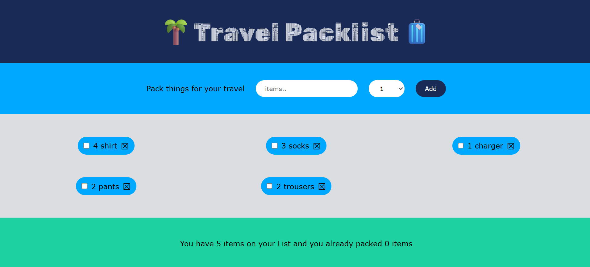

# Travel React App

A lightweight React application built with Vite.

## Application Screenshot

This screenshot shows the current travel app user interface:



## Project Overview

This project is a simple travel-themed React app created using Vite for fast development and production builds.

- React 19
- Vite 8
- ESLint support
- Static assets served from `public/`

## Getting Started

Install dependencies:

```bash
npm install
```

Start the development server:

```bash
npm run dev
```

Build for production:

```bash
npm run build
```

Preview the production build locally:

```bash
npm run preview
```

## Project Structure

- `public/` - static files served at root, including `image.png`
- `src/` - React source files
- `src/App.jsx` - main app component
- `vite.config.js` - Vite configuration
- `package.json` - project metadata and scripts

## Notes

- The `public` folder contents are served as static assets.
- Files in `public` are accessible at the root URL in development and production.
